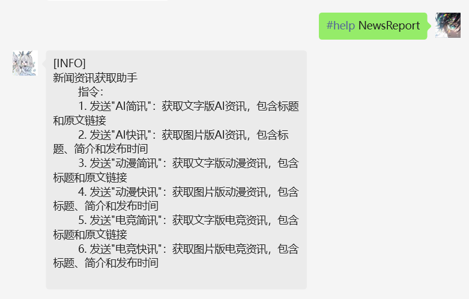
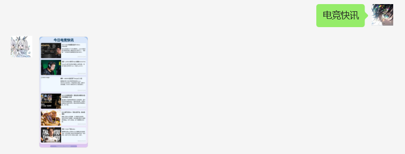

# chatgpt-on-wechat插件

# 插件名称 NewsReport 新闻资讯助手

一个功能强大的新闻资讯获取插件，支持AI、动漫、电竞资讯，提供文字版和图片版两种展示方式。

本插件基于以下项目整合开发：
- AIReport：https://github.com/Lingyuzhou111/AIReport.git
- DongmanReport：https://github.com/zhangxinyu521/DongmanReport.git

## 功能特点

- 多类型资讯支持：
  - AI资讯
  - 动漫资讯
  - 电竞资讯

- 双模式展示：
  - 文字版（含标题和链接）
  - 图片版（含标题、简介、时间和图片）

## 使用方法

### 一. 安装Html渲染所必需的环境
1. 安装playwright：在服务器终端执行以下命令：`pip install playwright`
2. 安装chromium：在服务器终端执行以下命令：`playwright install chromium`
3. 安装字体：在服务器终端执行以下命令：`yum groupinstall "fonts"`

### 二. 获取TIAN_API_KEY并申请接口
1. 在天聚数行API接口网站注册账号并登录，官网链接：https://www.tianapi.com

2. 点击网站首页的"控制台"进入个人主页，点击左上角"数据管理"➡️"我的密钥KEY"，复制默认的APIKEY备用。

3. 需要申请以下接口：
   - AI资讯：https://www.tianapi.com/apiview/223
   - 动漫资讯：https://www.tianapi.com/apiview/200
   - 电竞资讯：https://www.tianapi.com/apiview/199

4. 在对应详情页点击"申请接口"，然后点击"在线测试"测试接口是否正常。普通用户每天可免费调用100次。

### 三. 配置文件
1. 在微信机器人聊天窗口输入命令：`#installp https://github.com/zhangxinyu521/NewsReport.git` 安装插件

2. 在 `config.json` 中配置天行API密钥：
```json
{
    "TIAN_API_KEY": "你的API密钥"
}
```

3. 在微信机器人聊天窗口输入 `#scanp` 命令扫描新插件是否已添加至插件列表

4. 输入 `#help NewsReport` 查看帮助信息，返回相关帮助信息则表示插件安装成功。

## 可用命令

#### AI资讯
- `AI简讯`：获取文字版AI资讯（10条）
- `AI快讯`：获取图片版AI资讯（6条）

#### 动漫资讯
- `动漫简讯`：获取文字版动漫资讯（10条）
- `动漫快讯`：获取图片版动漫资讯（6条）

#### 电竞资讯
- `电竞简讯`：获取文字版电竞资讯（10条）
- `电竞快讯`：获取图片版电竞资讯（6条）

## 目录结构

```
NewsReport/
├── __init__.py
├── NewsReport.py
├── config.json
├── README.md
└── templates/
    └── news_template.html
```

## 使用样例
以下是插件的实际使用效果：

1. 文字版资讯展示：


2. 图片版资讯展示：


3. 帮助信息展示：


## 更新日志

### v1.0
- 整合AI、动漫、电竞资讯功能
- 优化UI设计和展示效果
- 支持文字版和图片版双模式

## 开发者
zxy

## 许可证
MIT License
